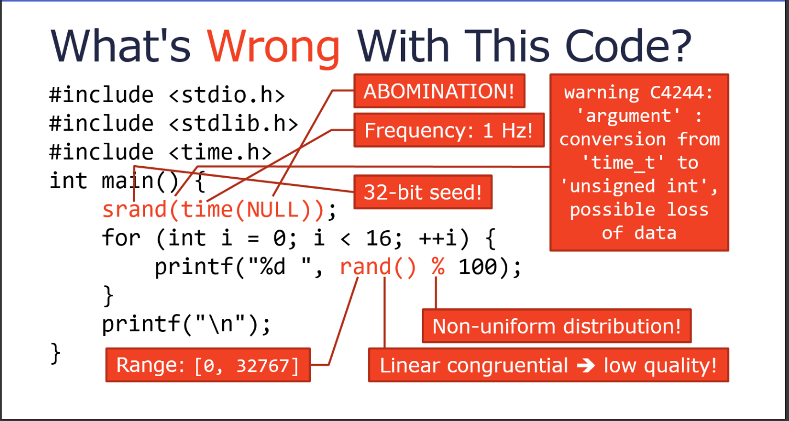
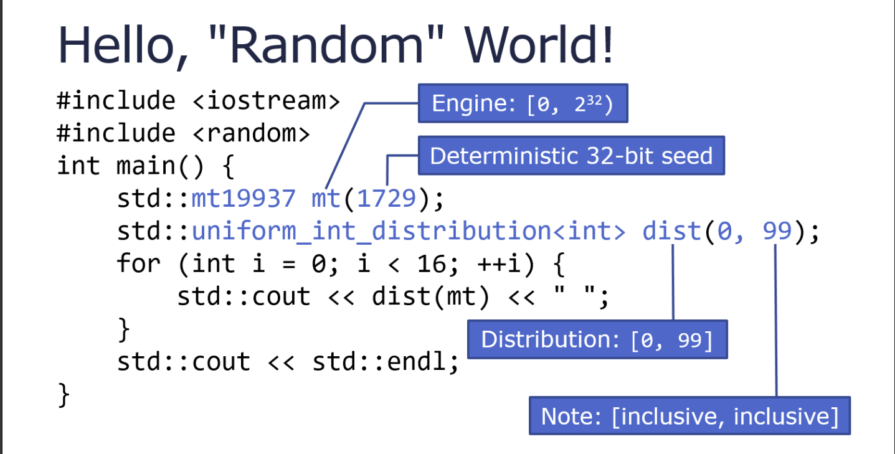

# 常见问题

## linux

### /usr/local/bin/cmake/cmake 不存在（远程调试）

```
sudo ln -s /usr/bin/cmake /usr/local/bin/cmake
```

### usr/bin/ld: cannot find -l

```
https://stackoverflow.com/questions/16710047/usr-bin-ld-cannot-find-lnameofthelibrary
```

example：

```cpp
/usr/bin/ld: cannot find -lzlib
ld -lzlib --verbose
```

### undefined reference to dlopen

```
https://stackoverflow.com/questions/16710047/usr-bin-ld-cannot-find-lnameofthelibrary
```

```
All you need to do is add ${CMAKE_DL_LIBS} to the target_link_libraries() call:
target_link_libraries(testlink ${CMAKE_DL_LIBS}
```

```
gcc dlopentest.c -ldl
```


# 容器

## 1 堆栈

栈，容器，适用于后进先出的数据结构

tack容器不支持随机访问，你能通过top()从栈顶获取元素，通过pop()从栈顶删除元素
不支持迭代器，不能遍历，输出时只能top()一个，然后，pop()一个

常用函数：

构造函数：stack<元素类型[,底层容器类型]> 堆栈对象(构造实参表);
　　　　　底层容器：vector/deque(默认)/list

　　　　    stack<string, vector<string> > ss;

　　　　　　stack<string, list<string> > ss;

　　　　　　stack<string> ss;

push(elem);//向栈顶添加元素，只能通过栈顶添加元素
void pop();//从栈顶移除第一个元素,不返回栈顶元素
top();//返回栈顶元素的引用，不删除元素,可通过赋值改变栈内元素，不能直接获取栈底元素
empty();//判断堆栈是否为空
size();//返回堆栈的大小

push -> push_back
pop -> pop_back
top -> back
size -> size
empty -> empty
clear -> clear

 


 

 

测试代码

```
void StackTest1()
{
    std::stack<std::string> ss;
    ss.push("C++!");
    ss.push("喜欢");
    ss.push("我们");
    //没有迭代器，只能通过循环遍历元素
    //输出:我们喜欢C++
    while (!ss.empty()) {
        std::cout << ss.top() << std::flush;
        ss.pop();
    }
    std::cout << std::endl;

}

void StackTest2()
{
    std::stack<std::string> ss;
    ss.push("C++!");
    ss.push("喜欢");
    ss.push("我们");

    //可通过赋值改变栈内元素的值
    ss.top() = "测试";
    //输出:测试喜欢C++
    while (!ss.empty()) {
        std::cout << ss.top() << std::flush;
        ss.pop();
    }
    std::cout << std::endl;
}
```

 

## 2 队列

队列，容器，适用于先进先出的数据结构

 queue 队列也是一个线性存储表，元素数据的插入在表的一端进行，在另一端删除，从而构成了一个先进先出FIFO（First In First Out）表。

插入一端称为队尾，删除一端称为队首。 

 默认使用双端队列deque来实现，queue也可看成一个容器适配器，将 deque 容器转换为 queue 容器。当然，也可以利用其他合适的序列容器作为底层实现queue容器。

 

 

 

 

 C++ STL对queue队列的泛化，是通过模板类型，将默认的deque双端队列类型导入，在内部创建一个序列容器对象，来处理 queue队列的数据存储和操作，包括queue队列是否为空、取队首元素、取队尾元素、元素入队和元素出队等。由于仅需要取队首和队尾元素的操作，因此queue队列容器并不提供任何类型的迭代器。

 

常用函数：

构造函数：queue<元素类型[,底层容器类型]> 队列对象(构造实参表);

　　　　　底层容器：deque(默认)/list

　　　　    queue<string, list<string> > qs;

　　　　　　queue<string> qs;

push(elem);//向队列尾部添加元素
void pop();//删除队首元素

front(); //获取队首元素的引用

back();//获取队尾元素的引用

*empty();//判断队列是否为空
size();//返回队列的大小*

push -> push_back
pop -> pop_front
back -> back
front -> front
size -> size
empty -> empty
clear -> clear

测试代码

```
void QueueTest()
{
    //queue<string, list<string> > qs;
    queue<string> qs;
    qs.push("我们");
    qs.push("喜欢");
    qs.push("C++!");
    //输出:我们喜欢C++
    /*while (!qs.empty()) {
        cout << qs.front() << std::endl;
        qs.pop();
    }*/
    //获取队首元素
    cout << qs.front() << endl;
    //获取队尾元素
    cout << qs.back() << endl;

    //删除队首元素
    qs.pop();
    //获取队首元素
    cout << qs.front() << endl;
    cout << endl;
}
```

 

# 计算函数调用时间

```cpp
#include <iostream>
#include <chrono>

void function()
{
    long long number = 0;

    for( long long i = 0; i != 2000000; ++i )
    {
       number += 5;
    }
}

int main()
{
    auto t1 = std::chrono::high_resolution_clock::now();
    function();
    auto t2 = std::chrono::high_resolution_clock::now();

    auto duration = std::chrono::duration_cast<std::chrono::microseconds>( t2 - t1 ).count();

    std::cout << duration;
    return 0;
}
```


# 获取环境变量的值

```c++
std::string java_home;
char *pathvar;
pathvar = getenv("JAVA_HOME");
java_home = pathvar;
std::cout << "java_home:" << java_home << std::endl;
```


# 获取当前目录

```
#ifdef _WIN32
#include <direct.h>
#define GetCurrentDir _getcwd
#else
#include <unistd.h>
#define GetCurrentDir getcwd
#endif


GetCurrentDir(buf, 100);
```

# goto

```
for(...) {
   for(...) {
      while(...) {
         if(...) goto stop;
         .
         .
         .
      }
   }
}
stop:
cout << "Error in program.\n";
```


# 获取环境变量

```
https://docs.microsoft.com/en-us/cpp/c-runtime-library/reference/getenv-s-wgetenv-s?view=vs-2019
```

example：

```
// crt_getenv_s.c
// This program uses getenv_s to retrieve
// the LIB environment variable and then uses
// _putenv to change it to a new value.

#include <stdlib.h>
#include <stdio.h>

int main( void )
{
   char* libvar;
   size_t requiredSize;

   getenv_s( &requiredSize, NULL, 0, "LIB");
   if (requiredSize == 0)
   {
      printf("LIB doesn't exist!\n");
      exit(1);
   }

   libvar = (char*) malloc(requiredSize * sizeof(char));
   if (!libvar)
   {
      printf("Failed to allocate memory!\n");
      exit(1);
   }

   // Get the value of the LIB environment variable.
   getenv_s( &requiredSize, libvar, requiredSize, "LIB" );

   printf( "Original LIB variable is: %s\n", libvar );

   // Attempt to change path. Note that this only affects
   // the environment variable of the current process. The command
   // processor's environment is not changed.
   _putenv_s( "LIB", "c:\\mylib;c:\\yourlib" );

   getenv_s( &requiredSize, NULL, 0, "LIB");

   libvar = (char*) realloc(libvar, requiredSize * sizeof(char));
   if (!libvar)
   {
      printf("Failed to allocate memory!\n");
      exit(1);
   }

   // Get the new value of the LIB environment variable.
   getenv_s( &requiredSize, libvar, requiredSize, "LIB" );

   printf( "New LIB variable is: %s\n", libvar );

   free(libvar);
}
```


# 随机数生成

## rand函数

在函数的开始处调用下面语句设置随机数种子

```c++
#include <cstdlib>
#include <ctime>
srand (static_cast <unsigned> (time(0)));
```

```cpp
double randMToN(double M, double N)
{
    return M + (rand() / ( RAND_MAX / (N-M) ) ) ;  
}
```

缺点：rand函数精度较低，最大随机数为65536，随机浮点数精度可能不足



## C++11random

```cpp
#include <random>
#include <iostream>
 
int main()
{
    std::random_device rd;  // 将用于获得随机数引擎的种子
    std::mt19937 gen(rd()); // 以 rd() 播种的标准 mersenne_twister_engine
    //随机浮点数生成器
    std::uniform_real_distribution<> dis(1, 2);
    for (int n = 0; n < 10; ++n) {
        // 用 dis 变换 gen 生成的随机 unsigned int 为 [1, 2) 中的 double
        std::cout << dis(gen) << ' '; // 每次调用 dis(gen) 都生成新的随机 double
    }
    std::cout << '\n';
}
```




# std::string的使用

## Split

```c++
#include <sstream>
#include <iostream>
#include <vector>

using namespace std;

int main() {
    vector<string> strings;
    istringstream f("denmark;sweden;india;us");
    string s;    
    while (getline(f, s, ';')) {
        cout << s << endl;
        strings.push_back(s);
    }
}
```

## double 转string

1. tostring

   std:to_string()方法只能精确到6位小数点

       double d = 3.1415926535897932384;
       std::string str = std::to_string(d);
       std::cout << str << std::endl; // 3.141593

2. 使用stringstream，在输入流时使用setprecision设置精度（精度为15位）。

   ```c++
   #include <sstream>
   #include <iomanip>
   
   double d = 3.1415926535897932384;
   std::string str;
   std::stringstream ss;
   ss << std::setprecision(15) << d;
   str = ss.str();  // 3.14159265358979
   ```

   

# std::thread的使用

1 添加头文件#include <thread>

2 使用全局函数作为线程函数

```
#include <iostream>
#include <thread>
#include <string>
using namespace  std;

void ThreadFunc1()
{
    std::cout << "ThreadFunc1" << std::endl;
}

void ThreadFunc2(int data)
{
    std::cout << "ThreadFunc2"<<" "<<data << std::endl;
}

void ThreadFunc3(int data1,int data2,string str)
{
    std::cout << "ThreadFunc3" << " "<< data1 << " "<< data2 << " "<< str << std::endl;
}

int main()
{
    thread th1(ThreadFunc1);
    th1.join();
    int data1 = 10;
    thread th2(ThreadFunc2,data1);
    th2.join();
    int data2 = 100;
    string str = "StrTest";
    thread th3(ThreadFunc3, data1,data2,str);
    th3.join();
    return 0;
}
```

3 使用类成员函数作为线程函数

```
#include <iostream>
#include <thread>
#include <string>
using namespace  std;


class Foo
{
public:
    void ThreadFunc1() {
        std::cout << "ThreadFunc1" << std::endl;
    }

    void ThreadFunc2(int data1,int data2) {
        std::cout << "ThreadFunc2" << " " << data1 << " " << data2 << std::endl;
    }
};

int main()
{
    Foo foo;
    thread th1(&Foo::ThreadFunc1,foo);
    th1.join();
    int data1 = 10,data2 = 100;
     thread th2(&Foo::ThreadFunc2, foo,data1,data2);
     th2.join();
    return 0;
}
```

4 使用lambda表达式作为线程函数

```
int main()
{
    thread th([] {while (1)
    {
        std::cout << "lambda" << endl;
    }
    });
    while (1)
    {
        std::cout << "main" << endl;
    }
    th.join();
    return 0;
}
```

 

结果如下：


 5 leetcode练习

题目描述：

```
public class Foo {
  public void one() { print("one"); }
  public void two() { print("two"); }
  public void three() { print("three"); }
}

三个不同的线程将会共用一个 Foo 实例。

线程 A 将会调用 one() 方法
线程 B 将会调用 two() 方法
线程 C 将会调用 three() 方法
请设计修改程序，以确保 two() 方法在 one() 方法之后被执行，three() 方法在 two() 方法之后被执行。
```

 

```
class Foo {
public:
    Foo() {
        
    }

    void first(function<void()> printFirst) {
        
        // printFirst() outputs "first". Do not change or remove this line.
     std::lock_guard<std::mutex> lock(mx_);
      printFirst();
      number_ = 1;
    }

    void second(function<void()> printSecond) {
        
        // printSecond() outputs "second". Do not change or remove this line.
        while (1)
      {
          if (number_ == 1)
          {
              std::lock_guard<std::mutex> lock(mx_);
              printSecond();
              number_ = 2;
              break;
          }
      }
    }

    void third(function<void()> printThird) {
        
        // printThird() outputs "third". Do not change or remove this line.
       while (1)
      {
          if (number_ == 2)
          {
             std::lock_guard<std::mutex> lock(mx_);
              printThird();
              number_ = 3;
              break;
          }
         
      }
    }
    
    std::mutex mx_;
    int number_ = 0;
};
class Foo
{
public:
    Foo(){}

    void first(function<void()> printFirst)
    {
        // printFirst() outputs "first". Do not change or remove this line.
        mx_.lock();
        printFirst();
        number_ = 1;
        mx_.unlock();
    }

    void second(function<void()> printSecond)
    {
        // printSecond() outputs "second". Do not change or remove this line.
        while (1)
        {
            if (number_ == 1)
            {
                mx_.lock();
                printSecond();
                number_ = 2;
                mx_.unlock();
                break;
            }
        }
    }

    void third(function<void()> printThird) 
    {
        // printThird() outputs "third". Do not change or remove this line.
        while (1)
        {
            if (number_ == 2)
            {
                mx_.lock();
                printThird();
                number_ = 3;
                mx_.unlock();
                break;

            }

        }
    }

    std::mutex mx_;
    int number_ = 0;
};
```

 

```
class Foo
{//三个线程分别有各自的函数，可以不用加锁
public:
    Foo() {}

    void first(function<void()> printFirst)
    {
        // printFirst() outputs "first". Do not change or remove this line.
        printFirst();
        number_ = 1;
    }

    void second(function<void()> printSecond)
    {
        // printSecond() outputs "second". Do not change or remove this line.
        while (1)
        {
            if (number_ == 1)
            {
                printSecond();
                number_ = 2;
                break;
            }
        }
    }

    void third(function<void()> printThird)
    {
        // printThird() outputs "third". Do not change or remove this line.
        while (1)
        {
            if (number_ == 2)
            {
                printThird();
                number_ = 3;
                break;

            }

        }
    }

    int number_ = 0;
};
```

 

# 文件操作

## 判断文件夹是否存在并创建文件夹

```
#include <experimental/filesystem>

namespace fs = std::experimental::filesystem::v1;

fs::path log_dir(fs::current_path().generic_string() +u8"\\Logs");
if (!fs::exists(log_dir) || !fs::is_directory(log_dir))
{
    fs::create_directory(log_dir);
}
```


# 区分系统是windows还是ubuntu

```
#ifdef _WIN32
#else
#endif
```


# linux和windows导出动态库

```
https://stackoverflow.com/questions/2164827/explicitly-exporting-shared-library-functions-in-linux
```

```cpp
#if defined(_MSC_VER)
    //  Microsoft 
    #define EXPORT __declspec(dllexport)
    #define IMPORT __declspec(dllimport)
#elif defined(__GNUC__)
    //  GCC
    #define EXPORT __attribute__((visibility("default")))
    #define IMPORT
#else
    //  do nothing and hope for the best?
    #define EXPORT
    #define IMPORT
    #pragma warning Unknown dynamic link import/export semantics.
#endif
```

# 加载动态库

## linux加载动态库

```
http://manpages.courier-mta.org/htmlman3/dlopen.3.html
```

```C++
#include <stdio.h>
#include <stdlib.h>
#include <dlfcn.h>
#include <gnu/lib-names.h>  /* Defines LIBM_SO (which will be a
                               string such as "libm.so.6") */
int
main(void)
{
    void *handle;
    double (*cosine)(double);
    char *error;

    handle = dlopen(LIBM_SO, RTLD_LAZY);
    if (!handle) {
        fprintf(stderr, "%s\n", dlerror());
        exit(EXIT_FAILURE);
    }

    dlerror();    /* Clear any existing error */

    cosine = (double (*)(double)) dlsym(handle, "cos");

    /* According to the ISO C standard, casting between function
       pointers and 'void *', as done above, produces undefined results.
       POSIX.1-2003 and POSIX.1-2008 accepted this state of affairs and
       proposed the following workaround:

           *(void **) (&cosine) = dlsym(handle, "cos");

       This (clumsy) cast conforms with the ISO C standard and will
       avoid any compiler warnings.

       The 2013 Technical Corrigendum to POSIX.1-2008 (a.k.a.
       POSIX.1-2013) improved matters by requiring that conforming
       implementations support casting 'void *' to a function pointer.
       Nevertheless, some compilers (e.g., gcc with the '-pedantic'
       option) may complain about the cast used in this program. */

    error = dlerror();
    if (error != NULL) {
        fprintf(stderr, "%s\n", error);
        exit(EXIT_FAILURE);
    }

    printf("%f\n", (*cosine)(2.0));
    dlclose(handle);
    exit(EXIT_SUCCESS);
}
```

## windows加载动态库

动态库静态库使用方法详解

```
https://www.cnblogs.com/LuckCoder/p/11208158.html
```

```
#include "stdafx.h"
#include <windows.h>

int main()
{
    HMODULE hmodule  = LoadLibrary("deftest.dll");
    if (hmodule)
    {
        typedef void(*LoadProc)();
        LoadProc loadproc = (LoadProc)GetProcAddress(hmodule, "MyPrint");
        if (loadproc)
        {
            loadproc();
            FreeLibrary(hmodule);
        }
        else
        {
            FreeLibrary(hmodule);
        }
    }
    return 0;
}
```

## 

# 基本函数

## scanf

```c++
//单个数字
scanf("%d", &num);
//两个数字
int num = 0, num1 = 0;
printf("请输入两个数字：");
scanf("%d%d", &num, &num1);
```

## for 循环

```
当for循环正常结束的时候循环变量一定落在数字范围之外

如果循环是采用break;语句结束的则循环结束，之后循环变量落在数字范围内

可以在循环里使用continue;语句直接跳到循环大括号的末尾，中间的语句这次循环都不执行

注：break跳出单层循环
```


## switch_case

```
int num = 0;
printf("请输入一个整数：");
scanf("%d", &num);
switch (num) 
{
case 0:
	printf("假\n");
	break;
default:
	printf("真\n");
	break;
}
```


# 基本知识

## 隐式类型转换

```
如果一个表达式里的数字类型不同就必须首先把这些数字转换成同一个类型然后再进行计算这个转换过程叫隐式类型转换，完全由计算机完成

隐式类型转换过程中一定把占地小的类型转换成占地大的类型

如果不同数字的类型占地大小一样就把整数类型转换成浮点类型，把有符号类型转换成无符号类型
```

## 强制类型转换

```
C语言里可以临时给数字任意指定类型,这叫做强制类型转换
强制类型转换的格式如下(char)300，强制类型转换有可能造成数据丢失

类型转换不会修改现有存储区的内容，只是用一个新的存储区记录转换后的结果，然后用这个新存储区里的内容做后面的计算
```

