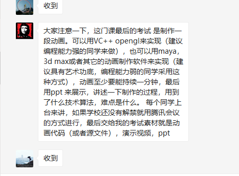

# 3dmax

# 自然辩证法

# 虚拟现实程序设计

各位同学，今天为虚拟现实程序设计课程第一节课，上课之前，有一些课堂要求，请每位同学都必须遵守：

1.上课时间为19点-21点25分，视频已上传至腾讯课堂和百度云，百度云链接：https://pan.baidu.com/s/1bkBkbhXoWpyt7_CZPjeuaQ 
提取码：vazs  请大家务必在课程要求时间内观看，课后作业要求在一星期内完成并提交。

2.请同学们在上课前实名（本人名字）进入腾讯会议，会议地址是ID：963 819 634  傍晚19：00开始上课签到，点到名的同学需要在聊天栏回复1（特殊情况需要提前与我请假）

3.上课期间内有任何关于课程问题可以随时在微信群或私信与我沟通，我会一直在线。

4.每节课课后作业提交至我邮箱630759161@qq.com，邮件主题和作业文档统一以个人姓名和学号命名。
5.若遇有不可抗力因素（如无网络、无电脑等情况提前私信与我）

各位同学，大家好，我是今天讲课的李老师，今天为虚拟现实程序设计课程第二节课

1.上课时间为19点-21点25分，视频已上传至腾讯课堂和百度云，百度云链接：链接:https://pan.baidu.com/s/1KvVGuVKExxmOY92yRPlQHw  密码:4oe2 请大家务必在课程要求时间内观看，课后作业要求在一星期内完成并提交。

2.请同学们在上课前实名（本人名字）进入腾讯会议，会议地址是ID：208 434 457傍晚19：00开始上课签到，点到名的同学需要在聊天栏回复1（特殊情况需要提前与我请假）

3.上课期间内有任何关于课程问题可以随时在微信群或私信与我沟通，我会一直在线。

4.每节课课后作业提交至我邮箱18810564208@163.com，邮件主题和作业文档统一以个人姓名和学号命名。
5.若遇有不可抗力因素（如无网络、无电脑等情况提前私信与我）

# 计算机动画

