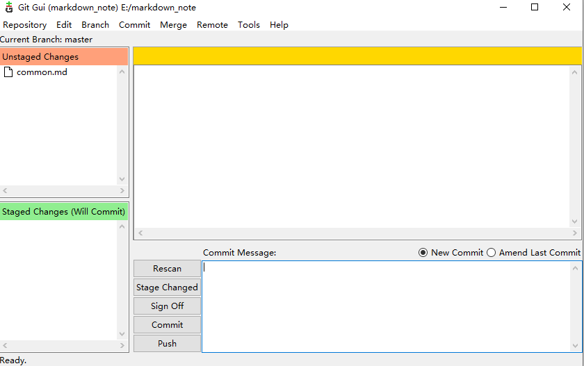
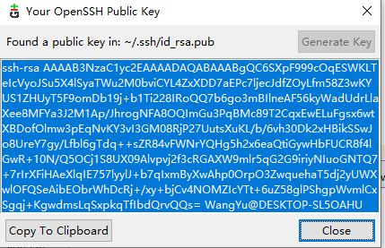
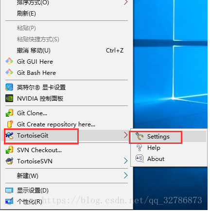
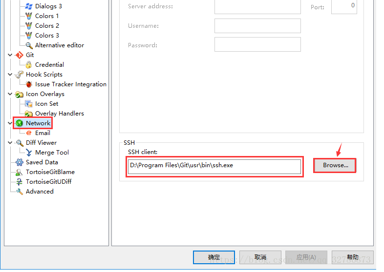

# git删除子模块

To remove a submodule you need to:

- Delete the relevant section from the .gitmodules file.
- Stage the .gitmodules changes git add .gitmodules
- Delete the relevant section from .git/config.
- Run git rm --cached path_to_submodule (no trailing slash).
- Run rm -rf .git/modules/path_to_submodule (no trailing slash).
- Commit git commit -m "Removed submodule "
- Delete the now untracked submodule files rm -rf path_to_submodule


# git 添加子模块

```
git submodule add 仓库地址 路径
```

```
example:git submodule add git@github.com:huiGod/git_child.git mymodule
```


其中，仓库地址是指子模块仓库地址，路径指将子模块放置在当前工程下的路径。 
注意：路径不能以 / 结尾（会造成修改不生效）、不能是现有工程已有的目录（不能順利 Clone）

# git 子模块的使用

```
git submodule init
git submodule update
```

或者

```
git submodule update --init --recursive
```


# git和TortoiseGit使用同一SSH密钥

 

1. 安装git和TortoiseGit

2. 右键，选择Git GUI here，弹出下面对话框

   

3. 点击“Help”,选择“Show SSH key”

   

4. 如果没有生成公钥，点击“Generate Key”,生成公钥，如果已经生成公钥，点击复制

5. 打开git服务器，如github，点击“setting”，选择“SSH and GPG keys”,选择“New SSK key”,将刚才复制的git公钥复制到里面，添加成功

6. 将TortoiseGit配置为和git使用同一密钥，空白地方右键-->TortoiseGit-->Settings，将Network中的SSH client改为Git目录下的ssh.exe，**注意目录为Git/usr/bin/ssh.exe**

   




# 查看谷歌浏览器保存的密码

1. 打开浏览器,点击右上角

2. 点击设置
3. 点击”自动填充“
4. 点击“密码”
5. 查看密码

