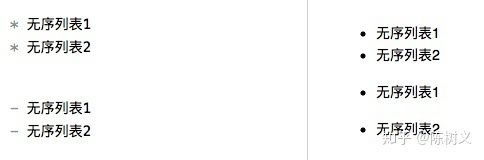
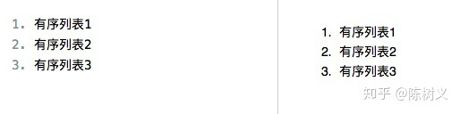
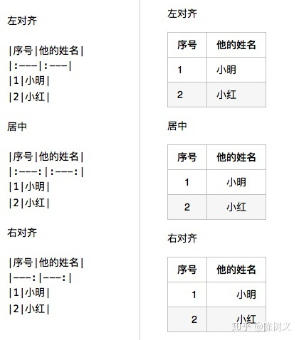

# **Markdown语法**

## 段落

Markdown 使用 `#` 号来表示段落。

## 字体加粗，斜体，加粗斜体

Markdown 使用一个星号表示斜体，两个星号表示加粗，三个星号表示加粗斜体。

## 无序列表

使用星号或者中横线来表示无序列表，注意后面需要加个空格。

## 有序列表

使用`数字+.`来表示有序列表，后面同样需要加个空格。

## **引用**

Markdown 使用 `>` 符号来表示引用。

## 图片

图片的样式与超链接非常相似，只需在前面加个感叹号就可以了，即用``表示图片。其中中括号表示图片未加载时的提示文字，小括号表示图片地址。

## 

## 代码块

我们使用 ` 号来表示代码块引用。

## 水平分割线

使用 `---` 来表示分割线

## **表格**

使用一根竖线来分隔各个单元格，使用冒号来决定单元格的对齐方向。

