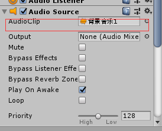
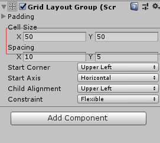
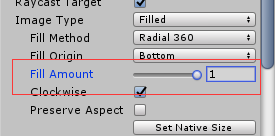
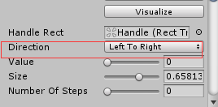
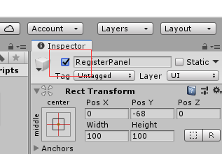
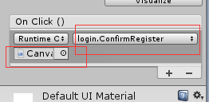
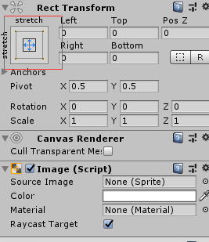
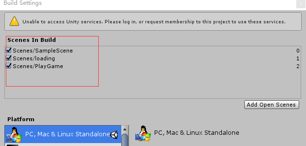

#  unity动画

1.Unity动画和模型的导入

模型导入：选中模型拖拽到场景中

动画导入：

1).给场景中的模型添加Animator组件

2）.创建一个动画控制器（Animator Controller）并指定到模型的Animator上

3）.打开动画控制器，将对应的动画片段拖拽到控制器中。

2.Unity动画的播放

在Animator中指定模型的Avatar

运行程序，人物开始播放动画

AnyState：任何状态 人物受伤动画

Entry：动画的入口

Exit：结束动画

 

通过makeTransition 控制动画的播放顺序。

3.Avatar骨骼配置

Unity骨骼系统：Avatar

导入模型以后，配置模型的Avatar

1）确保每个骨骼对应的位置正确

2）确保模型程T姿势站立

 

4.动画之间的切换

1）添加Idle动画

2）奔跑动画

通过W键控制人物的奔跑

1.获取到W键: Input.GetKey(KeyCode.W)

2.控制isRun属性为true : animator.SetBool("isRun",true);

播放不同的动画，选择不同的跳转属性

播放需要持续性的动画时（跑，走），使用bool

播放触发性的动画（技能，跳），使用trigger

 

攻击动画

1.获取到鼠标按键:Input.GetMouseButtonDown(0)

2.控制Attack属性触发:animator.SetTrigger("Attack");

```
 Animator animator;
 // Start is called before the first frame update
 void Start()
 {
 	animator = GetComponent<Animator>();
 }
void Update()
{
    //按下W键
    if(Input.GetKey(KeyCode.W))
    {
    //Debug.Log("按下W键");
    //设置条件
    animator.SetBool("isrun",true);
    }
    if (Input.GetKeyUp(KeyCode.W))
    {
    //Debug.Log("按下W键");
    //设置条件
    animator.SetBool("isrun", false);
    }

    //0，1，2分布代表鼠标左键，右键，滚轮按下
    if(Input.GetMouseButtonDown(0))
    {
    animator.SetTrigger("isattack");
    }
}
```


# ui 物件

## 音乐播放

1 可在Main Camera上添加Audio source 属性，设置Audio clip的值选择播放音乐



2 可通过AudioSource的volume属性设置音乐声音

3 可通过AudioSource的mute属性设置是否静音

4 可声明AudioClip变量加载音乐

```
public AudioClip[] clips = new AudioClip[3];
```

5 可通过调用AudioSource的Play函数播放音乐


## 输入框：InputField

## 滑动条：Slider

## 提示消息：Text

可通过Text 的text属性获取内容

## panel:iamge

1 可添加button属性点击image

2 可添加Grid Layout group属性，使物体顺序排列，可设置Cell Size 和Spacing设置格子大小和间距



3 当panel中的物体过于多时，可添加Mask属性，只显示物体的一部分，然后通过滚动条显示所有物体

4 可通过设置image的Fill Amount 属性显示部分图片，要实现物体明暗变化，可叠加两张相同图片



## 复选框：Toggle

1 可通过获取Toggle的isOn属性获取选中与否状态

2 可将多个复选框结合，每次只能选中一个，方法如下

1. 添加空物体Empty

2. 将多个复选框添加到空物体下方

3. 在空物体下方添加Toggle Group属性

4. 选中所有复选框，将空物体拖拽到复选框的Group属性框中

5. 将其中的一个复选框的ison属性勾选，其余复选框不勾选ison

   


## 滚动条：Scrollbar

1 可通过设置Scrollbar的direction属性设置滚动条的方向




2 要使物体添加滚动条，需要先创建滚动条，然后给物体添加Scroll Rect 属性，并将创建的滚动条赋值


# 使用unity中的ui物件

1. 引用头文件

   ```
   using UnityEngine.UI
   ```

2. 在start函数中初始化物体

```
 user = user.GetComponent<InputField>();
```

4. 面板一般使用iamge

5. 设置物体显示隐藏状态

   

```
 panel.SetActive(true);
```

6. 可以给iamge添加button属性，设置点击button后触发的函数

   

7. 设置image完全填充，选中image，点击下方红色选中区域，按住“Alt”键，点击右下角

   

8. 切换场景，点击file，点击buildsetting，将scene拖拽到弹出的对话框中，后面会显示场景序号，根据序号可切换场景，点击右上角关闭按钮，关闭对话框

   

9. 切换场景需要引用如下命名空间

   ```
   using UnityEngine.SceneManagement;
   ```

   ```
   SceneManager.LoadScene(2);//LoadScene参数为场景序号
   ```


10. 获取时间增量

    ```
    t += Time.deltaTime; //Time.deltaTime时间增量，平均0.02s
    ```

    


# float 转int

```
float f = 10.2;
int i = (int)f;
```


# 数字转字符串

```
float f = 10.2;
string s = f.ToString()
```


# 打印日志

```
Debug.Log("helloworld");
print("hello world")
```


# 设置物体初试位置

```
transform.position = new Vector3(0,0,0);
```


# 控制物体移动

```
transform.position += new Vector3(0.1f, 0, 0);
```


# 控制物体旋转

```
transform.Rotate(new Vector3(0, Time.deltaTime*100, 0 ));
```

# 控制物体变大

```
transform.localScale += new Vector3(0.01f, 0.01f, 0.01f);
```

